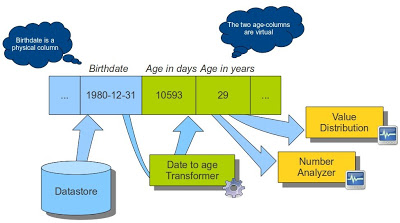

# analysisservices

Performs data profiling of tabular content. Uses the AnalyzerBeans library.

Data must fit within memory. Works on smaller datasets.

An Apache Spark based framework is being developed to supplement or supplant this framework.

Standard measures exist for basic data types (see below).

### Developing a Custom Analyzer

(Excerpt taken from documentation, Kasper Sørensen.)

To define a custom analyzer:

* You need to define a class that implements the Analyzer<R> interface. The generic 'R' argument defines the result type of the analyzer. We can reuse a built-in result-type or write our own.
* The class needs to be annotated with the @AnalyzerBean annotation. This annotation takes an argument: The display name of the analyzer.
* You need to inject one or more InputColumn<E>'s using the @Configured annotation in order to consume the incoming data. The <E> type-parameter defines the datatype of interest, which is also used to determine which kinds of data types the analyzer supports. In our case we'll use Date as the InputColumn type, because we want our analyzer to consume date values.

So here is our class when it has been created in accordance with the requirements above:

    @AnalyzerBean("Average date analyzer")
    public class AverageDateAnalyzer implements Analyzer<CrosstabResult> {
    
        @Configured
        InputColumn<Date> dateColumn;
        
        public void run(InputRow row, int distinctCount) { ... }
        public CrosstabResult getResult() { ... }

    }

Notice that we're using the built-in result type CrosstabResult, which represents a result consisting of a dimensional crosstab. We could have used other built-in result types or we could have created our own result-class - the only requirement is that it implements the AnalyzerResult interface.

So now to consider how to implement the concrete analyzer logic. We'll use a regular map to hold the distribution values. We'll map the weekday numbers to counts in this map. But we'll need to keep a count for each column that we're analyzing, so it's going to be a nested map:

    private Map<InputColumn<Date>, Map<Integer, Integer>> distributionMap;

To initialize the map we need to have the InputColumn's injected first, so the constructor won't do. In stead we can annotate a method with the @Initialize annotation, which will make AnalyzerBeans invoke the method when the bean has been properly initialized.

    @Initialize
    public void init() {
        distributionMap = new HashMap<InputColumn<Date>, Map<Integer, Integer>>();
        for (InputColumn<Date> col : dateColumns) {
            Map<Integer, Integer> countMap = new HashMap<Integer, Integer>(7);
            for (int i = Calendar.SUNDAY; i <= Calendar.SATURDAY; i++) {
                // put a count of 0 for each day of the week
                countMap.put(i, 0);
            }
            distributionMap.put(col, countMap);
        }
    }

Now that the map has been initialized we can proceed to implement the 'run' method:

    @Override
    public void run(InputRow row, int distinctCount) {
        for (InputColumn<Date> col : dateColumns) {
            Date value = row.getValue(col);
            if (value != null) {
                Calendar c = Calendar.getInstance();
                c.setTime(value);
                int dayOfWeek = c.get(Calendar.DAY_OF_WEEK);
                Map<Integer, Integer> countMap = distributionMap.get(col);
                int count = countMap.get(dayOfWeek);
                count += distinctCount;
                countMap.put(dayOfWeek, count);
            }
        }
    }

This should be pretty much "Java as usual". The only thing that should be new to you if you're an experienced Java developer is the way you extract values from the InputRow using the InputColumns as qualifiers: 

    Date value = row.getValue(col);

Notice that the value variable has the Date type. The AnalyzerBeans API takes advantage of type-safety to a large extent. Since the injected InputColumn's are defined as Date-columns this means that we can safely assume that the values in the incoming row is also of the Date-type. Furthermore the Date-column will be used to verify the configuration of AnalyzerBeans jobs and early error messages to the user if he tries to configure this particular Analyzer with a non-Date column. Now on to creating the result. As stated earlier we will use the CrosstabResult for this. The crosstab result is a pretty dynamic result type that can be used for a lot of purposes. It's metaphor is similar to DataCleaners result matrices but with added features. Here's how we build our crosstab:

    @Override
    public CrosstabResult getResult() {
        CrosstabDimension columnDimension = new CrosstabDimension("Column");
        CrosstabDimension weekdayDimension = new CrosstabDimension("Weekday");
        weekdayDimension.addCategory("Sunday").addCategory("Monday")
            .addCategory("Tuesday").addCategory("Wednesday").addCategory("Thursday")
            .addCategory("Friday").addCategory("Saturday");
        
        Crosstab crosstab = new Crosstab(Integer.class, columnDimension, weekdayDimension);
        for (InputColumn col : dateColumns) {
            columnDimension.addCategory(col.getName());
            CrosstabNavigator nav = crosstab.where(columnDimension, col.getName());
            Map countMap = distributionMap.get(col);
            nav.where(weekdayDimension, "Sunday").put(countMap.get(Calendar.SUNDAY));
            nav.where(weekdayDimension, "Monday").put(countMap.get(Calendar.MONDAY));
            nav.where(weekdayDimension, "Tuesday").put(countMap.get(Calendar.TUESDAY));
            nav.where(weekdayDimension, "Wednesday").put(countMap.get(Calendar.WEDNESDAY));
            nav.where(weekdayDimension, "Thursday").put(countMap.get(Calendar.THURSDAY));
            nav.where(weekdayDimension, "Friday").put(countMap.get(Calendar.FRIDAY));
            nav.where(weekdayDimension, "Saturday").put(countMap.get(Calendar.SATURDAY));
        }
        return new CrosstabResult(getClass(), crosstab);
    }

Now we're done. When this analyzer is run with a small sample of data in three columns the result looks like this: 

                 Order date Shipment date Delivery date
    Sunday                0             0             0
    Monday                2             0             1
    Tuesday               0             2             1
    Wednesday             0             0             0
    Thursday              1             0             0
    Friday                1             1             2
    Saturday              0             1             0

See the DistinctValuesAnalyzer for another example of a custom analyzer.

## Developing a custom Value Transformer

(Excerpt taken from documentation, Kasper Sørensen.)

Transformers are components for transforming/converting/tokenizing/generating new values based on the existing values of a dataset.

In this example, we'll transform birth dates of persons (represented as Date fields) into age fields (represented as a number field). A scenario is depicted below:

After the transformation I will be able to independently process the age field, eg. with a number analysis, value distribution or apply some business rule that depends on age.

The requirements for building a transformer class are the following:

* The class must implement the Transformer<E> interface, where <E> is the data type of the generated fields. In our case we will therefore implement Transformer<Integer>.
* The class must be annotated with the @TransformerBean annotation. The annotation takes an argument: The readable name of the transformer. We will thusly annotate: @TransformerBean(”Date to age”)
* In order to read from the incoming fields we need to inject an InputColumn<E> instance (or alternatively an array of these), where <E> is the data type of the incoming fields. To inject we use the @Configured annotation. In our example this translates to: @Configured InputColumn<Date> dateColumn;

After these steps our code will look something like this:

    @TransformerBean("Date to age")
    public class DateToAgeTransformer implements Transformer<Integer> {
    
        @Configured
        InputColumn<Date> dateColumn;
        
        @Override
        public OutputColumns getOutputColumns() {
            // TODO
            return null;
        }
        
        @Override
        public Integer[] transform(InputRow inputRow) {
            // TODO
            return null;
        }
    }

As we see, there are two methods defined by the Transformer interface, that we need to implement. They are:

* **getOutputColumns()**: This method is called by the framework to determine which virtual columns will be produced by the transformer. In our case it is quite simple: The transformer creates virtual columns for age (both in days and in years, just to make it more flexible). The method body should therefore just be:
return new OutputColumns("Age in days", "Age in years");

* **transform(InputRow)**: This method will be called for each row with values to be transformed. The return type of the method is an Integer-array because we chose to implement Transformer<Integer>. The indexes of the returned array should match the output columns, ie. index 0 is for ”Age in days” and index 1 is for ”Age in years”.

Let's have a look at the methods implementation:

    Integer[] result = new Integer[2];
    Date date = inputRow.getValue(dateColumn);
    
    if (date != null) {
        long diffMillis = today.getTime() - date.getTime();
        int diffDays = (int) (diffMillis / (1000 * 60 * 60 * 24));
        
        result[0] = diffDays;
    
        // use Joda time to easily calculate the diff in years
        int diffYears = Years.yearsBetween(new DateTime(date), new DateTime(today)).getYears();
        result[1] = diffYears;
    }

    return result;

### Standard measures

* Strings
    * Min words
    * Max words
    * Word count
    * Non-letter chars
    * Diacritic chars
    * Digit chars
    * Lowercase chars
    * Uppercase chars (excl. first letters)
    * Uppercase chars
    * Avg white spaces
    * Min white spaces
    * Max white spaces
    * Avg chars
    * Min chars
    * Max chars
    * Total char count
    * Entirely lowercase count
    * Entirely uppercase count
    * Blank count
    * Null count
    * Row count
    * Distinct values and frequency
    * Top 5 values and frequency
* Numbers
    * Column
    * Measure
    * Row count
    * Null count
    * Highest value
    * Lowest value
    * Sum
    * Mean
    * Geometric mean
    * Standard deviation
    * Variance
    * Sum of squares
    * Second moment
    * Median
    * 25th percentile
    * 75th percentile
    * Kurtosis
    * Skewness
* Dates
    * Lowest time
    * Highest time
    * Lowest date
    * Highest date
    * Null count
    * Row count
    * Measure
    * Column
    * Mean
    * Median
    * 25th percentile
    * 75th percentile
    * Kurtosis
    * Skewness
* Booleans
    * Frequency
    * False count
    * True count
    * Null count
    * Row count
